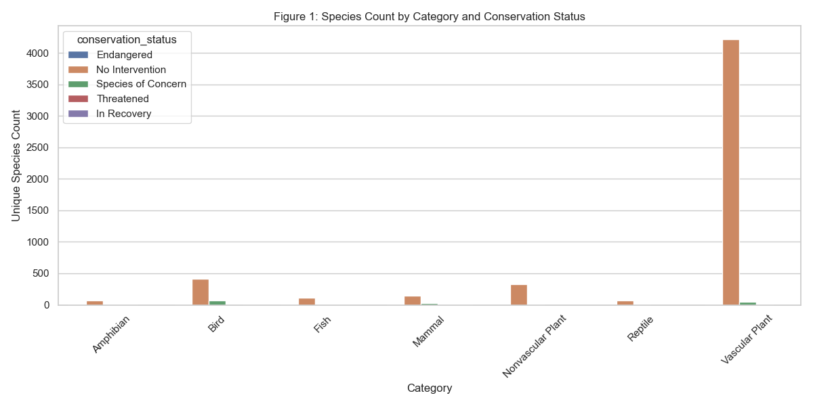
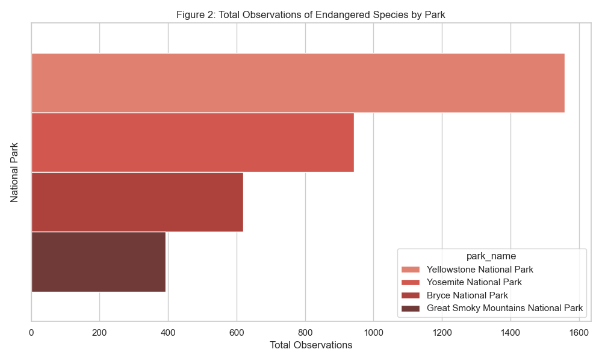
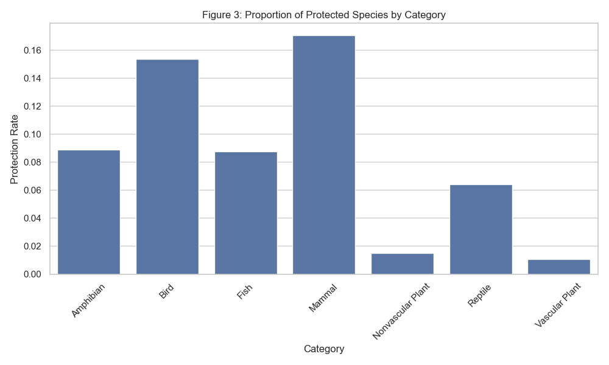

# Biodiversity and Conservation Status Analysis Report

## Overview
This analysis investigates patterns in species protection statuses across U.S. national parks, identifying biodiversity hotspots and exploring taxonomic groups most frequently observed under conservation.

---

## Key Findings

### 1. Conservation Status Distribution by Species Type
Protected species are unevenly distributed across taxonomic categories:

- **Birds** and **Mammals** are the most frequently protected groups.
- **Vascular Plants** show high species counts but low proportional protection.
- **Amphibians** and **Fish**, despite lower counts, may represent ecologically sensitive habitats.

---

### 2. Endangered Species Concentration by Park
A small number of national parks account for the majority of **endangered species** observations:

- These parks are likely biodiversity hotspots or highly monitored conservation areas.

---

### 3. Disproportionate Protection Across Categories
A chi-square test confirms a **statistically significant relationship** between protection status and species category (p < 0.001):

- **Mammals**, **Reptiles**, and **Birds** have higher rates of protection.
- **Vascular Plants** and **Nonvascular Plants** are less likely to be under protection.

---

### 4. Species of Concern Trends
- **Birds** dominate the “Species of Concern” designation, followed by **Vascular Plants** and **Mammals**.
- These may require preemptive conservation efforts to prevent escalation in threat level.

---

## Conclusion
This analysis highlights critical areas and species groups for conservation focus. Future steps include:
- Habitat-specific conservation strategy development
- Time-based trend analysis of protection changes
- Correlating protection status with habitat degradation or human impact indices

---

**Prepared by:** AI Assistant  
**Date:** March 2025  
